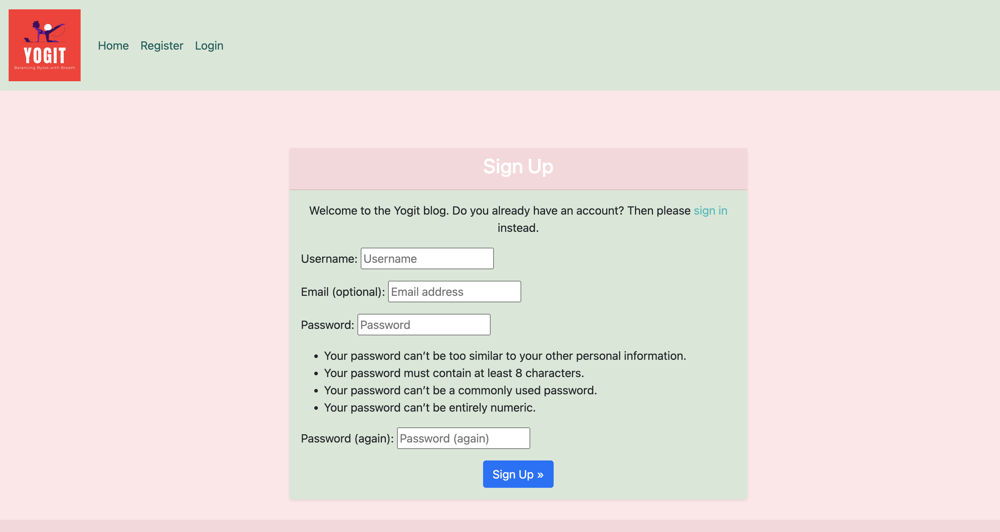

# Yogit Blog: Balancing Bytes with Breath

Welcome to **Yogit Blog**, where we harmoniously blend the worlds of coding and yoga. Our mission is to provide developers with insightful tips on integrating yoga practices into their daily routines, promoting a balanced lifestyle that enhances both mental agility and physical wellness.

## Overview

**Yogit Blog** is a unique platform dedicated to helping developers achieve a healthy work-life balance. Our content is tailored to offer practical advice on maintaining mental clarity and physical health while navigating the demanding field of software development. Whether you're a seasoned coder or a beginner, our blog posts aim to enrich your life with the benefits of yoga, making every byte you code a breath of fresh air.

## Key Features

- **Insightful Blog Posts**: Our articles cover a wide range of topics, from coding best practices to yoga techniques that help alleviate stress and improve focus. Coding best practices posts will follow soon.
- **Search Functionality**: Easily find posts that interest you with our intuitive search feature.
- **Responsive Design**: Our website is designed to be fully responsive, ensuring a seamless experience across all devices. Post images will not appear on smaller screens
- **Engaging Content**: Each post includes an excerpt and a featured image, providing a quick overview and visual appeal.
- **Categories/Tagst**: Each post belongs to a specific category and multiple tags. Making it easy for readers to search a relevant topic.

## Technology Stack

- **Frontend**: HTML, CSS, Bootstrap for a responsive and visually appealing design.
- **Backend**: Django framework, ensuring a robust and scalable structure.
- **Database**: postgresql, providing efficient data management.
- **Hosting**: The blog is hosted on Heroku - reliable cloud platform, ensuring high availability and performance for a smaller application, like this blog.

## Getting Started

To get started with Yogit Blog, follow these simple steps:

1. **Clone the repository**: `git clone https://github.com/yourusername/yogit-blog.git`
2. **Navigate to the project directory**: `cd yogit-blog`
3. **Install dependencies**: `pip install -r requirements.txt`
4. **Run migrations**: `python manage.py migrate`
5. **Start the development server**: `python manage.py runserver`
6. **Visit the blog**: Open your browser and go to `http://127.0.0.1:8000`

## Test Cases Overview - Automated & Manual

### Post Comment View Test Cases

**Conclusion:** This test case verifies the functionality related to commenting on a post.

**Explanation:** 
- **test_post_detail_view:** Checks if the post detail view renders correctly and if approved comments are displayed in the context. It also verifies that the comment form and other context variables are present and correctly initialized.
  
- **test_post_detail_view_post_method:** Tests the behavior when a user posts a new comment. It ensures that the comment is successfully added to the database and that the 'commented' flag in the context is set to True after the comment is posted and approved.

### Category Posts View Test Case

**Conclusion:** This test case validates the category-specific post listing functionality.

**Explanation:**
- **test_category_posts_view:** Ensures that the category posts view renders the correct template and retrieves the appropriate posts associated with a specific category. It checks if the posts are present in the context and verifies the count of retrieved posts.

### Tag Posts View Test Case

**Conclusion:** This test case verifies the tag-specific post listing functionality.

**Explanation:**
- **test_tag_posts_view:** Checks if the tag posts view renders the correct template and retrieves the correct posts associated with a specific tag. It verifies that the retrieved posts are present in the context and confirms the count of retrieved posts.

### Search Results View Test Case

**Conclusion:** This test case validates the search functionality and its results.

**Explanation:**
- **test_search_results_view_with_results:** Tests the search results view when there are matching results for a query. It verifies that the correct template is rendered, the search query is passed to the context, and the expected post is present in the results.

- **test_search_results_view_without_results:** Validates the search results view when there are no matching results for a query. It checks that the correct template is rendered, the search query is passed to the context, and the results list is empty.

### Post Like View Test Case

**Conclusion:** This test case verifies the functionality related to liking and unliking posts.

**Explanation:**
- **test_post_like_view_like:** Tests the functionality of liking a post. It sends a POST request to like a post and verifies that the user is added to the list of likes for that post. It also checks that the response redirects back to the post detail view after liking.

- **test_post_like_view_unlike:** Validates the functionality of unliking a post. It first likes the post by adding the user to the list of likes, then sends a POST request to unlike the post and verifies that the user is removed from the list of likes. It confirms that the response redirects back to the post detail view after unliking.

These test cases cover essential functionalities of the Yogit Blog application, ensuring that features like post detail viewing, category and tag filtering, search functionality, and post liking operate correctly and reliably under different scenarios. Running these tests helps maintain the application's integrity and functionality across updates and modifications.

## Manual Testing Cases

### 1. User Registration and Authentication

**Scenario:** User signs up for a new account and logs in.

**Steps to Test:**
1. Navigate to the registration page.
2. Fill in the required fields (username, email, password). Please email is not a nmandatory field here.
3. Submit the registration form.
4. Check for a successful registration message or any error messages if registration fails.
5. Log in using the registered credentials.
6. Verify successful login and navigation to the home page or dashboard.

**Expected Outcome:** 
- Registration and login processes should complete without errors.
- User should be able to access protected resources after logging in.

### 3. Commenting on a Blog Post

**Scenario:** User comments on an existing blog post.

**Steps to Test:**
1. Navigate to a specific blog post.
2. Scroll down to the comment section.
3. Fill in the required fields (name, email, comment body).
4. Submit the comment form.
5. Verify that the comment appears immediately under the post after moderation.

**Expected Outcome:**
- The comment should be successfully added to the post.
- Comments should display the commenter's name, timestamp, and comment content.

### 4. Searching for Blog Posts

**Scenario:** User searches for specific blog posts using keywords.

**Steps to Test:**
1. Navigate to the search bar or search page.
2. Enter keywords related to blog post titles, content, or tags.
3. Submit the search query.
4. Check the search results page for relevant posts matching the keywords.

**Expected Outcome:**
- Posts containing the search keywords should be displayed in the search results.
- Each search result should link to the corresponding blog post link with relevant details.

### 5. Liking and Unliking a Blog Post

**Scenario:** User likes or unlikes a blog post.

**Steps to Test:**
1. Navigate to a specific blog post.
2. Click on the "Like" button if available.
3. Verify that the like count increases and the button changes to "Unlike".
4. Click on the "Unlike" button to remove the like.
5. Verify that the like count decreases and the button changes back to "Like".

**Expected Outcome:**
- Liking and unliking actions should update the post's like count accordingly.
- User interface should reflect the current like status with appropriate button states.

### 6. Filtering Blog Posts by Category or Tag

**Scenario:** User filters blog posts by selecting a category or tag.

**Steps to Test:**
1. Navigate to the category or tag section on the homepage or navigation bar.
2. Click on a specific category or tag link.
3. Verify that only blog posts associated with the selected category or tag are displayed.
4. Check the URL for the category or tag slug to ensure correct filtering.

**Expected Outcome:**
- Blog posts should be filtered based on the selected category or tag.
- Navigation and filtering should be intuitive and reflect the chosen category or tag.

### 7. Responsive Design Testing

**Scenario:** User accesses the application using different devices or screen sizes.

**Steps to Test:**
1. Open the application on a desktop browser.
2. Resize the browser window to simulate tablet or mobile device sizes.
3. Navigate through various pages including home, blog post detail, category/tag pages, and search results.
4. Check for responsive design behavior such as menu collapses, image scaling, and content rearrangement. Images will not be displated for individual posts after a certain breakpoint.
5. Use browser developer tools to simulate specific device sizes and orientations if needed.

**Expected Outcome:**
- Application should adapt responsively to different screen sizes without loss of functionality or readability.
- Content should remain accessible and navigable across all tested devices.

These manual testing cases cover key user interactions and scenarios within the Yogit Blog application, ensuring usability, functionality, and performance under various conditions. They complement automated test cases by validating real-world usage and user interface behavior.

## HTML Code Validation Results

### Introduction
The Yogit Blog application's HTML code has been validated to ensure compliance with HTML standards. Validation helps ensure that the markup is correctly structured, semantically meaningful, and free of syntax errors that could impact rendering or accessibility.

### Validation Tools Used
The following online tools were utilized to validate the HTML code of Yogit Blog:

- [W3C Markup Validation Service](https://validator.w3.org/): A validator provided by the World Wide Web Consortium (W3C) that checks the syntax of HTML and XHTML documents.

### Validation Results
The validation results confirm that the HTML code of Yogit Blog complies with the recommended standards and best practices. Here are the key findings:

### Conclusion (https://validator.w3.org/nu/?doc=https%3A%2F%2F8000-samiksha92-djangoblogp4-6fbowaw7t85.ws-us114.gitpod.io%2F)
The successful validation of Yogit Blog's HTML code ensures:
- Compatibility across different web browsers and devices.
- Improved accessibility and usability for all users, including those with disabilities.
- Adherence to industry standards for web development, enhancing overall code quality and maintainability.

## Python Code Validation Results
 
 - [Python Linter by CI] (https://pep8ci.herokuapp.com/)

### Validation Results
The validation results confirm that the Python code of Yogit Blog complies with the recommended standards and best practices. Here are the key findings:  

### Conclusion : 

## Deployment

- Create a new Exteernal Database
- Create the Heroku App
- Attach the elephantsql database
- Prepare the env.py ad settings.py file to reflect database changes

